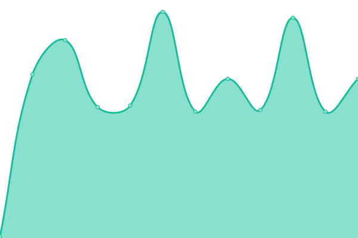

# [📈 Live Status](https://status.famillepercheron.fr): <!--live status--> **🟧 Partial outage**

This repository contains the open-source uptime monitor and status page for [DamsPer](https://status.famillepercheron.fr), powered by [Upptime](https://github.com/upptime/upptime).

With [Upptime](https://upptime.js.org), you can get your own unlimited and free uptime monitor and status page, powered entirely by a GitHub repository. We use [Issues](https://github.com/DamsPer/upptime/issues) as incident reports, [Actions](https://github.com/DamsPer/upptime/actions) as uptime monitors, and [Pages](https://status.famillepercheron.fr) for the status page.

<!--start: status pages-->
<!-- This summary is generated by Upptime (https://github.com/upptime/upptime) -->
<!-- Do not edit this manually, your changes will be overwritten -->
<!-- prettier-ignore -->
| URL | Status | History | Response Time | Uptime |
| --- | ------ | ------- | ------------- | ------ |
|  [Google](https://www.google.com) | 🟩 Up | [google.yml](https://github.com/DamsPer/upptime/commits/HEAD/history/google.yml) | 

 123ms
     
 | 

<a href="https://status.famillepercheron.fr/history/google">100.00%</a>
    

|  [Freebox](https://4fslxp38.fbxos.fr:8443/) | 🟥 Down | [freebox.yml](https://github.com/DamsPer/upptime/commits/HEAD/history/freebox.yml) | 

 0ms
     
 | 

<a href="https://status.famillepercheron.fr/history/freebox">4.63%</a>
    

|  [Maison](https://maison.famillepercheron.fr) | 🟩 Up | [maison.yml](https://github.com/DamsPer/upptime/commits/HEAD/history/maison.yml) | 

 953ms
     
 | 

<a href="https://status.famillepercheron.fr/history/maison">100.00%</a>
    

|  [Test Broken Site](https://thissitedoesnotexist.koj.co) | 🟥 Down | [test-broken-site.yml](https://github.com/DamsPer/upptime/commits/HEAD/history/test-broken-site.yml) | 

 0ms
     
 | 

<a href="https://status.famillepercheron.fr/history/test-broken-site">100.00%</a>
    

|  [Mail - Port 143](mail.famillepercheron.fr) | 🟩 Up | [mail-port-143.yml](https://github.com/DamsPer/upptime/commits/HEAD/history/mail-port-143.yml) | 

 123ms
     
 | 

<a href="https://status.famillepercheron.fr/history/mail-port-143">100.00%</a>
    

|  [Mail - Port 465](mail.famillepercheron.fr) | 🟩 Up | [mail-port-465.yml](https://github.com/DamsPer/upptime/commits/HEAD/history/mail-port-465.yml) | 

 121ms
     
 | 

<a href="https://status.famillepercheron.fr/history/mail-port-465">100.00%</a>
    

|  [Mail - Port 587](mail.famillepercheron.fr) | 🟩 Up | [mail-port-587.yml](https://github.com/DamsPer/upptime/commits/HEAD/history/mail-port-587.yml) | 

 122ms
     
 | 

<a href="https://status.famillepercheron.fr/history/mail-port-587">100.00%</a>
    

|  [Mail - Port 25](mail.famillepercheron.fr) | 🟩 Up | [mail-port-25.yml](https://github.com/DamsPer/upptime/commits/HEAD/history/mail-port-25.yml) | 

 121ms
     
 | 

<a href="https://status.famillepercheron.fr/history/mail-port-25">46.28%</a>
    

|  [Mail - Port 993](mail.famillepercheron.fr) | 🟩 Up | [mail-port-993.yml](https://github.com/DamsPer/upptime/commits/HEAD/history/mail-port-993.yml) | 

 120ms
     
 | 

<a href="https://status.famillepercheron.fr/history/mail-port-993">100.00%</a>
    

<!--end: status pages-->

[**Visit our status website →**](https://status.famillepercheron.fr)

## 📄 License

- Powered by: [Upptime](https://github.com/upptime/upptime)
- Code: [MIT](./LICENSE) © [Anand Chowdhary](https://anandchowdhary.com), supported by [Pabio](https://pabio.com)
- Data in the `./history` directory: [Open Database License](https://opendatacommons.org/licenses/odbl/1-0/)
